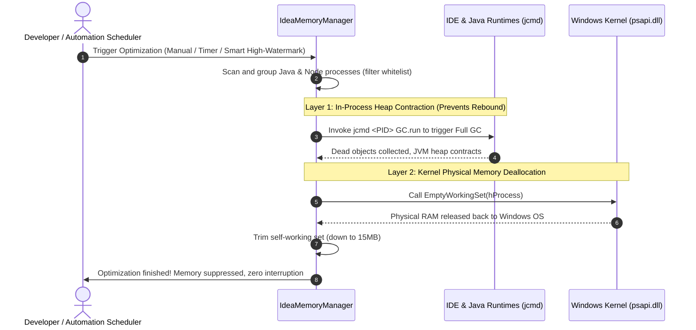

<div align="center">

# ⚡ IdeaMemoryManager

**A lightweight, non-destructive memory optimizer & anti-freeze guardian tailored for IntelliJ IDEA, Spring Boot microservices, and Node.js frontend tooling.**

[](LICENSE)
[](https://dotnet.microsoft.com)
[](https://microsoft.com/windows)
[](CONTRIBUTING.md)

[简体中文文档](README_CN.md) · [Features](#-features) · [How it Works](#-how-it-works) · [Architecture](#-architecture) · [Quick Start](#-quick-start)

</div>

---

## 💡 Overview

When working with **IntelliJ IDEA** alongside local Spring Boot microservices and Node.js frontend tooling:
1. **Severe Memory Expansion**: Complex enterprise projects easily consume **6 GB to 10 GB+** across child Java and Node processes, leaving Windows sluggish or freezing during active development.
2. **Rebound with Generic Optimizers**: Typical kernel-based cleaning tools fail to trigger garbage collection inside JVM runtimes; working set trims rebound back to high levels within seconds.
3. **Productivity Loss from Restarts**: Developers are forced to constantly reboot IDEs, severing active debug sessions, open terminals, and hot-reload watchers.

**IdeaMemoryManager** employs a dual-layer strategy: **Application-Level Real JVM GC (`jcmd`) + Kernel WorkingSet Page Trimming**. It compresses resident physical memory safely by gigabytes in milliseconds while **100% preserving active debug sessions, database pools, and Vite/Webpack hot-reloading**.

---

## 🚀 Features

- 🛡️ **Non-Destructive & Safe Reclamation**:
  - Never terminates processes. Spring Boot services, debug breakpoints, and development terminals keep running seamlessly.
- ⚡ **Dual-Layer Anti-Rebound Engine**:
  - **Layer 1 (JVM Deep GC)**: Triggers runtime Full GC via `jcmd <PID> GC.run` inside the JVM to truly reclaim dead syntax trees and soft caches.
  - **Layer 2 (Kernel Trim)**: Trims physical page working sets via Windows APIs (`EmptyWorkingSet`), eliminating the root cause of rebound.
- 🛡️ **Idle-Aware Intelligent Deferral**:
  - Built-in user inactivity & CPU workload detection. Auto-optimization automatically defers during active typing, compilation, or debugging to eliminate Stop-The-World (STW) latency.
- 🍃 **Zero Self-Footprint**:
  - Automatically trims its own working set when minimized or idle, keeping its resident physical footprint as low as **10MB ~ 15MB**.
- 🌐 **JetBrains Family Ecosystem Support**:
  - Automatically detects IntelliJ IDEA, PyCharm, WebStorm, GoLand, DataGrip, CLion, Rider, RustRover, Android Studio, and Fleet.
- 📋 **Process Topology Drawer & Whitelisting**:
  - Expandable detailed process tree showing process categories, PIDs, and RAM usage.
  - Individual process selection and right-click persistent whitelisting for heavy batch or benchmark services.
- 🔬 **In-Depth JVM Heap Telemetry**:
  - Millisecond-level telemetry via `jcmd GC.heap_info` displaying Eden, Old Gen, and Metaspace usage with interactive hover tooltips.
- 📈 **Real-Time 60-Second Sparkline Chart**:
  - Ultra-smooth double-buffered GDI+ sparkline visually demonstrating the immediate cliff-drop in memory usage upon optimization.
- 🌐 **Native Bilingual Interface (i18n)**:
  - Supports English and Simplified Chinese out of the box with one-click instant toggling.
- 🏆 **Lifetime Savings Dashboard**:
  - Tracks total physical memory reclaimed across all optimization cycles.

---

## 🔬 How it Works



---

## 🏗️ Architecture

A clean, modular layered architecture built with modern .NET 8 WinForms:

```
IdeaMemoryManager/
├── src/
│   ├── Common/             # Infrastructure (ByteSizeFormatter, Logger, I18n)
│   ├── Interop/            # Windows P/Invoke native APIs (GetLastInputInfo, etc.)
│   ├── Config/             # Strongly-typed configuration, persistence & autostart
│   ├── Core/
│   │   ├── Models/         # Domain models (ProcessTarget, JvmHeapInfo, etc.)
│   │   ├── Scanner/        # ProcessScanner (JetBrains family discovery engine)
│   │   ├── Strategy/       # Strategy pattern: ICleanStrategy (JvmGc, WorkingSetTrim)
│   │   ├── Engine/         # MemoryCleanEngine (Unified coordinator & self-trimmer)
│   │   ├── Telemetry/      # JvmTelemetryService (jcmd heap inspection)
│   │   └── Automation/     # SmartScheduler, IdleDetector (Idle-Aware self-healing)
│   ├── UI/
│   │   ├── Controls/       # SparklineControl (60s chart), ProcessDrawerControl (Drawer list)
│   │   ├── Views/          # MainForm (Modern dark floating panel)
│   │   └── Tray/           # TrayService (System tray integration)
│   └── Program.cs          # Application entry point & unhandled exception guards
├── assets/
│   ├── badges/             # Bundled local vector SVG badges (Zero network lag)
│   └── app.ico             # High-res multi-layer application icon
├── .github/workflows/      # Automated CI/CD build & release workflows
├── IdeaMemoryManager.csproj# .NET 8 Project file
├── LICENSE                 # MIT License
├── CONTRIBUTING.md         # Contribution guidelines
├── README.md               # English documentation (default)
├── README_CN.md            # Chinese documentation
└── build.bat               # One-click Windows build script
```

---

## 🚀 Quick Start

### Option A: Pre-built Binary
Run the pre-compiled `IdeaMemoryManager.exe` directly from the release assets.

### Option B: Build from Source
Prerequisite: [.NET 8.0 SDK](https://dotnet.microsoft.com/download/dotnet/8.0).

```bash
# 1. Clone the repository
git clone https://github.com/BowlongRise/IdeaMemoryManager.git
cd IdeaMemoryManager

# 2. Compile release configuration
dotnet build -c Release

# 3. Launch application
./bin/Release/net8.0-windows/IdeaMemoryManager.exe
```

Or execute `build.bat` on Windows.

---

## 📄 License

Distributed under the [MIT License](LICENSE).