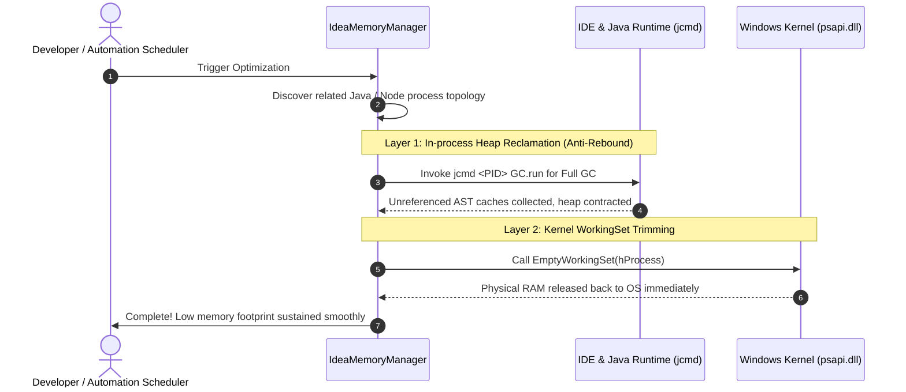

<div align="center">

# ⚡ IdeaMemoryManager

**An industrial-grade, non-destructive memory optimizer & anti-freeze guardian tailored for IntelliJ IDEA, Spring Boot microservices, and Node.js frontend tooling.**

[](LICENSE)
[](https://dotnet.microsoft.com)
[](https://microsoft.com/windows)
[](CONTRIBUTING.md)

[简体中文文档](README_CN.md) · [Features](#-features) · [How it Works](#-how-it-works) · [Architecture](#-architecture) · [Quick Start](#-quick-start)

</div>

---

## 💡 Overview

When working with **IntelliJ IDEA** alongside local Spring Boot microservices and Node.js frontend tooling:
1. **Memory Runaway**: Processes routinely amass **6 GB to 10 GB** of RAM within hours, causing UI stuttering, prolonged GC pauses, and IDE lockups.
2. **Rebound Problem**: Generic memory cleaners purge OS working sets without triggering JVM heap reclamation, causing RAM usage to **rebound back within seconds**.
3. **Forced Restarts**: Developers are forced to restart their IDE daily, breaking focus and development momentum.

**IdeaMemoryManager** introduces a dual-layer optimization approach: **Application-layer JVM Full GC (via `jcmd`) + Kernel WorkingSet Trim**. It reclaims gigabytes of RAM while keeping debugging sessions, HTTP endpoints, and frontend HMR **100% active and uninterrupted**.

---

## 🚀 Features

- 🛡️ **Zero-Risk Non-Destructive**: Never terminates processes. Spring Boot services and frontend hot module replacement stay completely alive.
- ⚡ **Dual-Layer Anti-Rebound**: Cleans JVM heap caches before trimming working sets, preventing immediate memory rebound.
- 🌐 **Bilingual Support (i18n)**: Seamless instant toggle between **English** and **Simplified Chinese**.
- 🌐 **Fullstack Topology Awareness**: Discovers IDE hosts, microservices, Node.js runtimes, and language servers automatically.
- 🎯 **Smart Threshold Self-Healing**: Automatically performs background cleanup when RAM usage exceeds a configurable limit (e.g. >3.5 GB).
- 🏆 **Lifetime Savings Telemetry**: Persistently records cumulative gigabytes reclaimed over time.


---

## 🔬 How It Works



---

## 🏗️ Architecture

```
IdeaMemoryManager/
├── src/
│   ├── Common/             # Utilities (ByteSizeFormatter, Logger, I18n)
│   ├── Interop/            # Windows Native P/Invoke signatures
│   ├── Config/             # Configuration models, JSON persistence, and startup registry
│   ├── Core/
│   │   ├── Models/         # Domain models (ProcessTarget, MemoryStats, CleanReport)
│   │   ├── Scanner/        # ProcessScanner (Process topology discovery)
│   │   ├── Strategy/       # Strategy pattern: ICleanStrategy implementations
│   │   ├── Engine/         # MemoryCleanEngine (Execution and metrics aggregation)
│   │   └── Automation/     # SmartScheduler (Self-healing and scheduled triggers)
│   ├── UI/
│   │   ├── Views/          # MainForm (Modern dark floating panel)
│   │   └── Tray/           # TrayService (System tray icon & notifications)
│   └── Program.cs          # Entry point and global unhandled exception handlers
├── .github/workflows/      # Automated CI/CD build & release workflow
├── IdeaMemoryManager.csproj# .NET 8 Project file
├── LICENSE                 # MIT License
├── CONTRIBUTING.md         # Contribution guidelines
├── README.md               # Chinese documentation
├── README_EN.md            # English documentation
└── build.bat               # One-click Windows build script
```

---

## 🚀 Quick Start

### Option A: Run Precompiled Binary
Run `IdeaMemoryManager.exe` directly from the release output.

### Option B: Build from Source
Requires [.NET 8.0 SDK](https://dotnet.microsoft.com/download/dotnet/8.0).

```bash
# 1. Clone repository
git clone https://github.com/BowlongRise/IdeaMemoryManager.git
cd IdeaMemoryManager

# 2. Build Release configuration
dotnet build -c Release

# 3. Launch application
./bin/Release/net8.0-windows/IdeaMemoryManager.exe
```

Or execute `build.bat` on Windows.

---

## 📄 License

Distributed under the [MIT License](LICENSE).
