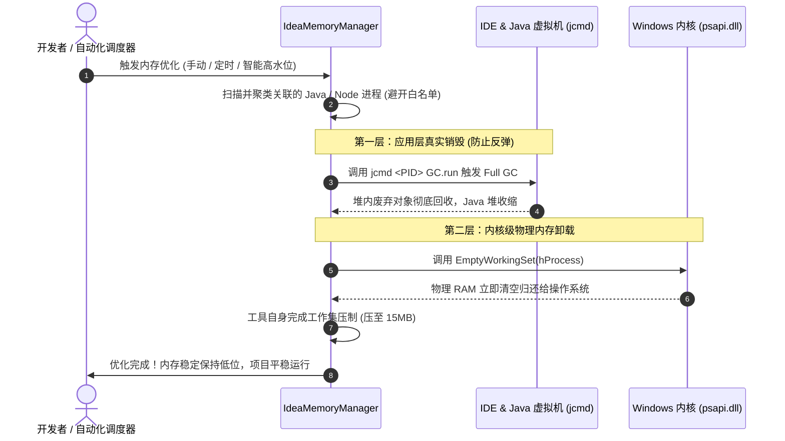

<div align="center">

# ⚡ IDEA内存管理 (IdeaMemoryManager)

**专为全栈与微服务开发者打造的轻量、无损内存优化与防卡死守护工具**

[](LICENSE)
[](https://dotnet.microsoft.com)
[](https://microsoft.com/windows)
[](CONTRIBUTING.md)

[English Documentation](README.md) · [功能特性](#-核心特性) · [工作原理](#-核心工作原理) · [架构设计](#-架构设计) · [快速开始](#-快速开始)

</div>

---

## 💡 痛点背景

使用 **IntelliJ IDEA** 配合本地 Spring Boot 微服务与 Node 前端工具链开发时，开发者通常面临以下挑战：
1. **内存急剧膨胀**：多模块开发过程中，IDEA、后台微服务与前端守护进程常驻内存，数小时内可累积占用 **6 GB ~ 10 GB** 物理内存，导致开发机系统卡顿甚至转圈假死。
2. **常规清理工具反弹**：基于通用内核 API 的普通内存清理软件无法触发 Java 虚拟机内部回收，内存短暂下降后数秒内即会反弹回原始高位。
3. **高频重启打断开发**：传统方案通常只能依赖每日重启 IDE，打断编码状态。

**IdeaMemoryManager** 采用 **「应用层 JVM 真实 Full GC + 操作系统内核工作集裁剪」** 双层回收架构，在 **100% 保证项目活跃连接、调试会话及热更新不中断** 的前提下，一键将物理内存开销安全压缩，并有效杜绝反弹。

---

## 🚀 核心特性

- 🛡️ **非破坏性安全优化**：
  - 基于 Windows 内核工作集安全收缩机制，不杀死任何进程。
  - 正在运行的 Spring Boot 接口、Vite/Webpack 热更新、终端控制台及数据库连接池 **持续平稳运行**。
- ⚡ **双层联动 · 彻底杜绝反弹**：
  - **第一层 (JVM 深度 GC)**：自动调用运行环境的 `jcmd` 工具指令触发 Full GC，真正销毁 Java 堆内废弃的语法分析与软引用缓存；
  - **第二层 (内核工作集裁剪)**：随后安全释放物理内存页，从根源消除反弹诱因。
- 🛡️ **空闲感知智能避让 (Idle-Aware GC)**：
  - 基于 Windows 原生输入感知与 CPU 负载采样，在开发者正在打字编码、Maven/Gradle 编译打包或断点调试时**自动顺延自愈**，彻底杜绝 GC 导致的输入卡顿。
- 🍃 **自身极致“零开销” (Zero Self-Footprint)**：
  - 窗口失焦、最小化或每次清理完成后，工具自动对自身执行内存裁剪，常驻内存仅占 **10MB ~ 15MB**，绝不争抢系统资源。
- 🌐 **JetBrains 全家桶生态全面覆盖**：
  - 自动识别与支持 IntelliJ IDEA、PyCharm、WebStorm、GoLand、DataGrip、CLion、Rider、RustRover、Android Studio 及 Fleet 等多 IDE 混合开发环境。
- 📋 **进程拓扑抽屉与常驻白名单**：
  - 支持一键展开可滚动的子进程树，查看各进程类别、PID 与实时内存占用；
  - 支持独立勾选，支持右键将关键微服务一键加入常驻白名单永久跳过清理。
- 🔬 **JVM 堆内实际分布透视 (Telemetry)**：
  - 毫秒级解析 Java 堆内新生代 Eden、老年代与元空间 Metaspace 实际占用，悬浮即可直观掌握内存构成与垃圾缩减。
- 📈 **60 秒内存平滑走势图 (Sparkline)**：
  - 内置高性能双缓冲渐变折线图，毫秒级反映内存波动与优化后的断崖式下跌。
- 🌐 **多语言一键切换 (i18n)**：
  - 原生支持 **English** 与 **简体中文**，随系统语言自动识别，并支持在界面右上角一键切换。
- 🏆 **累计释放成效看板**：
  - 本地记录累计节省的物理内存数据，直观量化优化成果。

---

## 🔬 核心工作原理



---

## 🏗️ 架构设计

遵循清晰的分层解耦规范：

```
IdeaMemoryManager/
├── src/
│   ├── Common/             # 基础设施 (ByteSizeFormatter, Logger, I18n)
│   ├── Interop/            # Windows 原生 P/Invoke 接口定义 (GetLastInputInfo 等)
│   ├── Config/             # 强类型配置实体、持久化与自启管理
│   ├── Core/
│   │   ├── Models/         # 领域数据模型 (ProcessTarget, JvmHeapInfo 等)
│   │   ├── Scanner/        # ProcessScanner (JetBrains 全家桶拓扑发现引擎)
│   │   ├── Strategy/       # 策略模式: ICleanStrategy (JvmGc, WorkingSetTrim)
│   │   ├── Engine/         # MemoryCleanEngine (统一优化调度与自压缩引擎)
│   │   ├── Telemetry/      # JvmTelemetryService (jcmd 堆内遥测解析)
│   │   └── Automation/     # SmartScheduler, IdleDetector (空闲感知与高水位自愈)
│   ├── UI/
│   │   ├── Controls/       # SparklineControl (60s走势图), ProcessDrawerControl (抽屉列表)
│   │   ├── Views/          # MainForm (现代深色微悬浮面板)
│   │   └── Tray/           # TrayService (系统托盘集成)
│   └── Program.cs          # 应用程序入口与未处理异常守护
├── assets/
│   ├── badges/             # 仓库内置矢量 SVG 徽标 (极速秒开)
│   └── app.ico             # 多分辨率应用图标
├── .github/workflows/      # 自动化 CI/CD 构建与 Release 发布脚本
├── IdeaMemoryManager.csproj# .NET 8 工程项目文件
├── LICENSE                 # MIT 开源协议
├── CONTRIBUTING.md         # 社区贡献指引
├── README.md               # 英文官方主文档 (默认)
├── README_CN.md            # 简体中文说明文档
└── build.bat               # 本地自动化构建脚本
```

---

## 🚀 快速开始

### 方式 A：运行预构建版本
直接运行发布产物 `IdeaMemoryManager.exe` 即可使用。

### 方式 B：源码构建
要求环境：[.NET 8.0 SDK](https://dotnet.microsoft.com/download/dotnet/8.0)。

```bash
# 1. 克隆代码仓库
git clone https://github.com/BowlongRise/IdeaMemoryManager.git
cd IdeaMemoryManager

# 2. 编译项目
dotnet build -c Release

# 3. 运行程序
./bin/Release/net8.0-windows/IdeaMemoryManager.exe
```

或直接在 Windows 环境中双击运行 `build.bat`。

---

## 📄 开源许可证

本项目基于 [MIT License](LICENSE) 协议开源。